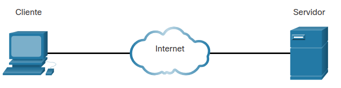
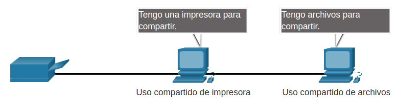
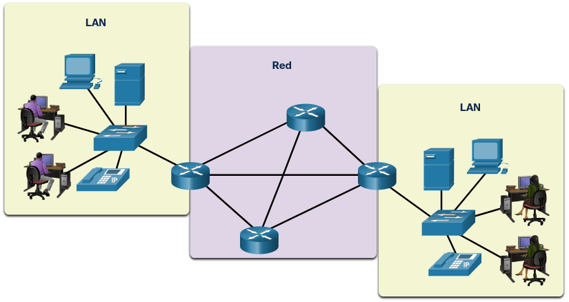
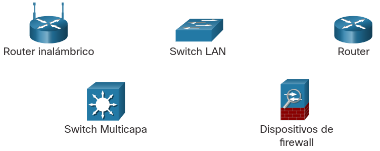
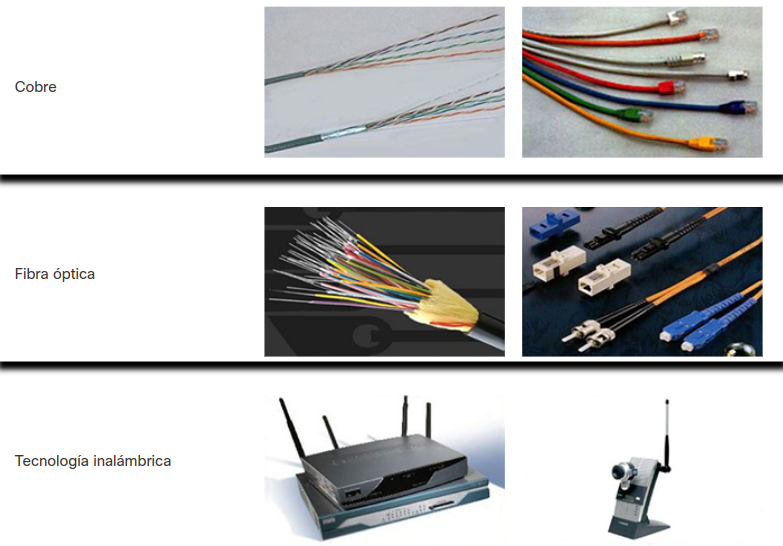
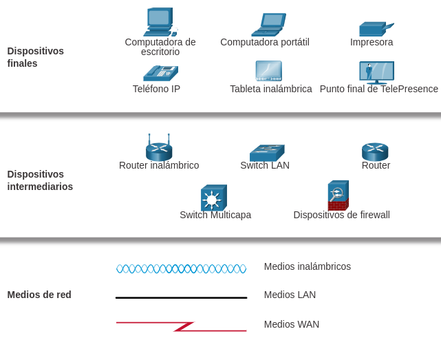

# Las redes afectan nuestras vidas.
## 1.1.1. Las redes nos conectan.
Entre todos los elementos esenciales para la existencia humana, la necesidad de interactuar está justo después de la necesidad de sustentar la vida. La comunicación es casi tan importante para nosotros como el aire, el agua, los alimentos y un lugar para vivir.
## 1.1.2. La expercienda de aprendizaje en Cisco NA.
Desde 1997, CNA trabaja haciendo un unico objetivo: la educación y el desarrollo de habilidades de la proxima generacion.

## 1.1.3. No hay límites.
Los avances en tecnologías de red son y han sido muy importantes en el mundo actual. Gracias a esto la comunicación entre diferentes partes del mundo ha sido menos difícil.

# 1.2. Componentes de la red.
## 1.2.1. Roles de host.
Todos los dispositivos que están conectados a una red y participan directamente en la comunicación de la red se clasifican como hosts. Los hosts se pueden llamar dispositivos finales. Algunos hosts también se llaman clientes.
El termino hosts se refiere a los dispotivios de la red que se les asigna un número para fines de comunicación el cual identifica el host dentro de la red.
Este número se denomina direcion de **protocolo de internet (IP)**.

Los servidores son computadores con software que proporciona información a otros dispositivos finales. Cada servicio requiere un software de servidor independiente.

Figura ilustre de como funciona lo anterior dicho.

Un ejemplo de software de clientes es un navegador web.

Tres tipos comunes de software de servidor.
|Tipo|Descripción|
|----|-----------|
|Correo electrónico|Los clientes usan cliente de correo software, como Microsoft Outlook para acceder|
|Web|Los clientes usan software de navegador como Firefox, para acceder a paginas web|
|Archivo|El serivdor de arhivos almacena archivos de usuario y empresariales en una ubicación central. Los dispositivos cliente acceden a estos archivos con software cliente como Explorador de archivos de Windows|

## 1.2.2. Entre pares.
El software de cliente y servidor generalmente se ejecuta en computadoras separadas. pero también es posible usar una sola para ambos roles al mismo tiempo. Este tipo de red se denomina **red entre pares**.

Ventajas y desventajas:
|Ventajas|Desventajas|
|--------|-----------|
|Fácil de configurar|La administración no está centralizada|
|Menos complejo|No son tan seguras|
|Menor costo porque es posible que no se necesiten dispositivos de red ni servidores dedicados|No son escalables|
|Se pueden utilizar para tareas sencillas|Todos los dispositivos pueden funcionar como clientes y como servidores lo que puede lentificar el rednimiendo|
---

## 1.2.3. Dispositivos Finales.
Los dispositivos de red con los que más se familiarizan las personas se denominan dispositivos finales. Para distinguir un dispositivo final de otro, cada dispotivo de una red tiene una dirección. Cuando un dispositivo final inicia la comunicación, utiliza la dirección del dispositivo final de destio para especificar dénde entregar el mensaje.

Un terminal es el origen o el destino de un mensaje transmitido a través de la red.

> Los datos se originan con un dispositivo final, fluyen por la red y llegan  aun dispositivo final.

## 1.2.4. Dispositivos intermediarios.
Los dispositivos intermedios conectan los dispositivos finales individuales a la red. Los dispositivos intermedios proporcionan conectividad  garantizan el flujo de datos en toda la red.

Los dispositivos intermedios usan la dirección del dispositivo final de destino, junto con información sobre las interconexiones de la red, para determinar la ruta que los mensajes deben tomar a través de la red.

Figura con algunos ejemplos de dispositivos intermediarios más comunes.

Un dispositivo de red intermediario puede admitir algunas de estas funciones o todas ellas:

- Regenerar y retransmitir señales de comunicación.
- Conservar información acerca de las rutas que existen a través de la red y de internetwork.
- Notificar a otros dispositivos los errores y ñas faññas de comunicación.
- Dirigir los datos a lo largo de rutas alternativas cuando hay una falla en el enlace.
- Clasificar y dirigir mensajes de acuerdo a las prioridades.
- Permitir o denegar el flujo de datos de acuerdos a los parametros de seguridad.

---

# 1.2.5. Medios de red.
La comunicación se transmite a través de una red en los medios. El medio proporciona el canal por el cual viaja el mensaje desde el origen hasta el destino.

Las redes modernas utilizan principalmente tres tipos de medios para interconectar dispositivos, como se muestra en la figura:

- **Hilos metálicos dentro de cables** - Los datos se codifican en impulsos eléctricos.
- **Fibras de vidrio o plástico (Cable de fibra óptica)** - Los datos se codifican como pulsos de luz.
- **Transmisión inalámbrica** - Los datos se codifican a través de la modulación de frecuencias específicas de ondas electromagnéticas.

> Hay cuatro criterios principales para elegir los medios de red y son:
> - ¿Cuál es la distancia áxima en la que el medio puede transportar una señal exitosamente?
> - ¿Cuál es el entorno en el que se instalarán los medios?
> - ¿Cuál es la cantidad de datos y a qué velocidad deben transmitirse?
> - ¿Cuál es el costo del medio y de la instalación?
---

## 1.2.6. Preguntas y respuestas

1. ¿Cuál de los siguientes es el nombre de todas las computadoras conectadas a una red que participan directamente en la comunicación de red?

R//: Hosts

2. Cuando los datos se codifican como pulsos de luz ¿Que medios se utilizan para transmitir los datos?

R//: Cable de fibra óptica

3. ¿cuáles dos dispositivos son dispositivos intermedios?

R//: Router, apilados

# Topologías y representaciones de red.

## 1.3.1. Representaciones de red.
Los arquitectos y administradores de redes deben de mostrar el aspecto que tendrán sus redes. Necesitan ver facilmente que componentes se conectan a otros componentes, donde se ubicaran y como se conectaran.

El diagrama permite comprender como se conectan los dispositivos en un red grande. Este tipo de representacion se llama **Diagrama de topología**

Además de estas representaciones, se utiliza una terminología especializada para describir cómo cada uno de estos dispositivos y medios se conenctan entre sí:

- **Tarjeta de interfaz de red(Network Interface Card)(NIC)** - Una NIC conecta fisicamente el dispositivo final a la red.
- **Puerto físico** - Un conector o conexión en un dispositivo de red donde se conectan los medios a un terminal u otro dispositivo de red.
- **Interfaz** - Puertos especializados en un dispositivo de red que se conecta a redes individuales. Debido a que los routers conectan redes, los puertos en un router se denominan interfaces de red.

# Tipos comunes de redes.

# Conexiones a Internet.

# Redes Confiables.

# Tendencias de red.

# Seguridad de la red.

# El profesional de TI.
