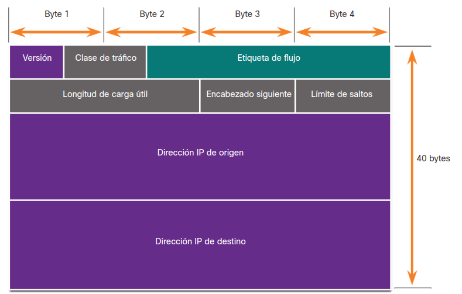
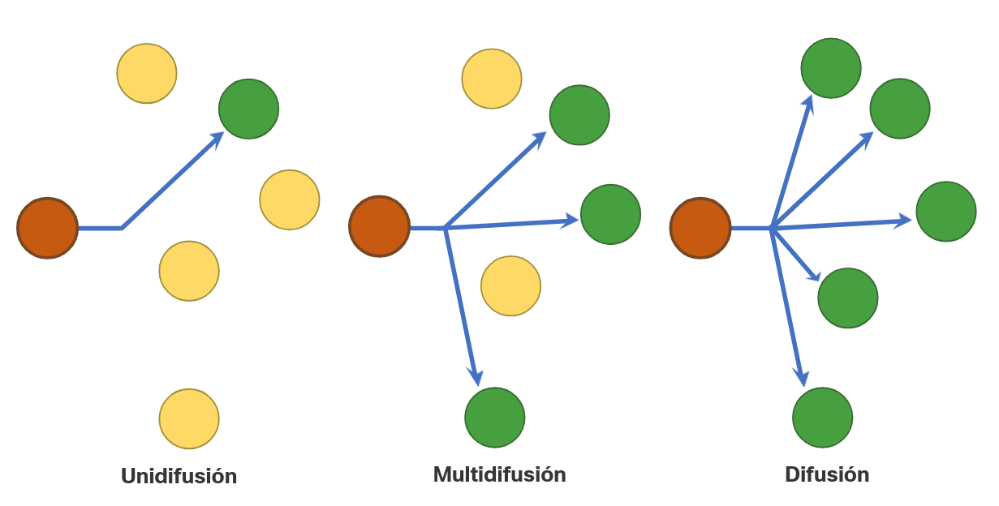
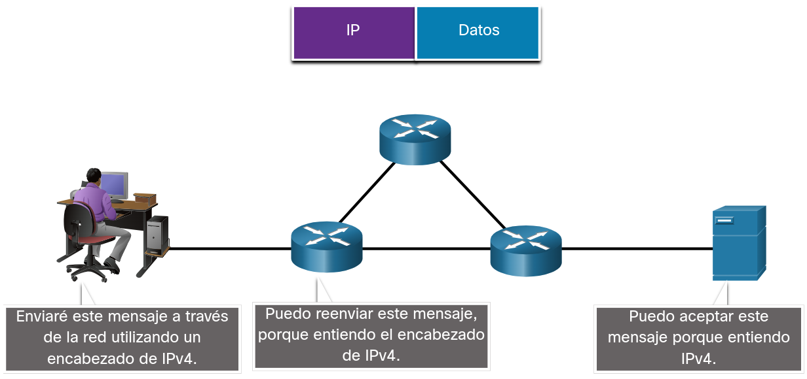

# 3.1. Las reglas.

## 3.1.2. Fundamentos de la comunicación.

Las redes pueden variar en lo que respecta al tamaño, la forma y la función. Una red puede ser tan compleja como los dispositivos conectados a través de Internet, o tan simple como dos PC conectadas directamente entre sí mediante un único cable, o puede tener cualquier grado de complejidad intermedia.
Para que se produzca la comunicación, los dispositivos deben saber "cómo" comunicarse.

Todos los métodos de comunicación tienen tres elementos en común:

- Los orígenes de los mensajes.

- Destino del mensaje (recibidor).

- Canal.

## 3.1.3. Protocolos de comunicación.

**Analogía**

**Red**

## 3.1.4. Establecimiento de reglas.

Antes de comunicarse entre sí, las personas deben utilizar reglas o acuerdos establecidos que rijan la conversación.

Los mensajes deben escribirse usando reglas (es decir, protocolos) que osn necesarias para una comunicación efectiva.

Los protocolos deben tener en cuenta los siguientes requisitos para entregar correctamente un mensaje que sea comprendido por el receptor:

- Un emisor y un receptor identificados.
- Idioma y gramática común.
- Velocidad y momento de entrega.
- Requisitos de confirmación o acuse de recibo.

## 3.1.5. Requisitos de protocolo de red.

Los protocolos utilizados en las comunicaciones de red comparten muchos de estos fundamentos. Además de identificar el origen y el destino, los protocolos informáticos y de red definen los detalles sobre la forma en que los mensajes se transmiten a través de una red. Los protocolos informáticos comunes incluyen los siguientes requisitos:

- Codificación de los mensajes.
- Formato y encapsulamiento del mensaje.
- Tamaño del mensaje.
- Sincronización del mensaje.
- Opciones de entrega del mensaje.

## 3.1.6. Codificación de los mensajes.

Uno de los primeros pasos para enviar un mensaje es codificarlo. La codificación es el proceso mediante el cual la información se convierte en otra forma aceptable para la transmisión. La decodificación revierte este proceso para interpretar la idea.

## 3.1.7. Formato y encapsulamiento del mensaje.

Cuando se envía un mensaje desde el origen hacia el destino, se debe utilizar un formato o estructura específicos. Los formatos de los mensajes dependen del tipo de mensaje y el canal que se utilice para entregar el mensaje.

**Analogía:** Un ejemplo común de requerir el formato correcto en las comunicaciones humanas es cuando se envía una carta.

**Red:** Semejante a enviar una carta, un mensaje que se envía a través de una red de computadoras sigue reglas de formato específicas para que pueda ser entregado y procesado.

Protocolo de Internet (IP) es un protocolo con una función similar a la del ejemplo sobre. En la figura, los campos del paquete de Protocolo de Internet versión 6 (IPv6) identifican el origen del paquete y su destino. IP es responsable de enviar un mensaje desde el origen del mensaje al destino a través de una o más redes.

**Nota**: Los campos del paquete IPv6 se analizan en detalle en otro módulo.

## 3.1.8. Tamaño del mensaje.

Otra regla de comunicacón es el tamaño del mensaje.

**Analogía:** Cuando las personas se comunican, los mensajes que envían, normalmente, están divididos en fragmentos más pequeños u oraciones.

**Red:** De manera similar, cuando se envía un mensaje largo de un host a otro a través de una red, es necesario separarlo en partes más pequeñas. Las reglas que controlan el tamaño de las partes, o tramas que se comunican a través de la red, son muy estrictas. También pueden ser diferentes, de acuerdo con el canal utilizado. Las tramas que son demasiado largas o demasiado cortas no se entregan.

Las restricciones de tamaño de las tramas requieren que el host de origen divida un mensaje largo en fragmentos individuales que cumplan los requisitos de tamaño mínimo y máximo.

## 3.1.9. Sincronización del mensaje.

El tiempo de los mensajes también es muy importante en las comunicaciones de red. el tiempo de los mensajes incluye lo siguiente:

- **Control de flujo**: Este es el proceso de gestión de la velocidad de transmisión de datos.
- **Tiempo de espera de respuesta (Response Timeout)**:Si una persona hace una pregunta y no escucha una respuesta antes de un tiempo aceptable, la persona supone que no habrá ninguna respuesta y reacciona en consecuencia.
- **El método de acceso**:Determina en qué momento alguien puede enviar un mensaje.
  cuando un dispositivo desea transmitir en una LAN inalámbrica, es necesario que la tarjeta de interfaz de red (NIC) WLAN determine si el medio inalámbrico está disponible.

## 3.1.10. Opciones de entrega del mensaje.

Un mensaje se puede entregar de diferentes maneras.

**Analogía:** En algunos casos, una persona desea comunicar información a un solo individuo. Otras veces, esa persona puede necesitar enviar información a un grupo de personas simultáneamente o, incluso, a todas las personas de un área.

**Red:** Las comunicaciones de red tienen opciones de entrega similares para comunicarse.

- **Unicast:** La información se transmite a un único dispositivo final.
- **Multicast:** La información se transmite a uno o varios dispositivos finales.
- **Transmisión:** La información se transmite a todos los dispositivos finales.

## 3.1.11. Una nota sobre el icono de nodo.

Los documentos y topologías de red suelen representar dispositivos de red y finales mediante un icono de nodo. Los nodos se suelen representar como un círculo. La figura muestra una comparación de las tres opciones de entrega diferentes utilizando iconos de nodo en lugar de iconos de ordenador.

## 3.1.12. Preguntas y respuestas.

1. ¿Cuál es el proceso de convertir la información en la forma adecuada para la transmisión?

**R//:** Codificación

2. ¿Qué paso del proceso de comunicación se ocupa de identificar correctamente la dirección del remitente y del destinatario?

**R//:** Formateo

3. ¿Cuáles son los tres componentes de la sincronización de mensajes? (Escoja tres opciones).

**R//:** Control de flujo, Método de acceso, Tiempo de espera de respuesta

4. ¿Qué método de entrega se utiliza para transmitir información a uno o más dispositivos finales, pero no a todos los dispositivos de la red?

**R//:** Multidifusión

# 3.2. Protoclos.

## 3.2.1. Descripción general del protocolo de red.

Para que cada dispositivo final pueda comunicarse a través de una red, cada dispositivo debe cumplir el mismo conjunto de reglas y estas reglas se denominan protocolos.

Los protocolos de red definen un formato y un conjunto de reglas comunes para intercambiar mensajes entre dispositivos.Son implementados por dispositivos finales y dispositivos intermediarios en software, hardware o ambos. Cada protocolo de red tiene su propia función, formato y reglas para las comunicaciones.

|Tipo de protocolo|Descripción|
|----|-----------|
|**Protocolos de comunicaciones de red**|La familia de tecnologías Ethernet implica una variedad de protocolos como IP, Protocolo de control de transmisión (TCP), HyperText Protocolo de transferencia (HTTP) y muchos más.|
|**Protocolos de seguridad de red**|Los protocolos protegen los datos para proporcionar autenticación, integridad de los datos y Cifrado de datos Ejemplos de protocolos seguros incluyen Secure Shell (SSH), Secure Sockets Layer (SSL) y Capa de transporte Security (TLS).|
|**Protocolos de routing**|Los protocolos permiten a los routeres intercambiar información de ruta, comparar ruta y, a continuación, seleccionar la mejor ruta al destino e inalámbrica. Ejemplos de protocolos de enrutamiento incluyen Abrir ruta más corta primero OSPF y Protocolo de puerta de enlace de borde (BGP).|
|**Protocolos de detección de servicios**|Los protocolos se utilizan para la detección automática de dispositivos o servicios. Entre los ejemplos de protocolos de descubrimiento de servicios se incluyen Dynamic Host Protocolo de configuración (DHCP) que descubre servicios para la dirección IP y Sistema de nombres de dominio (DNS) que se utiliza para realizar traducción de nombre a dirección IP.|

## 3.2.2. Funciones de protocolo de red.

Los protocolos de red son responsables de una variedad de funciones necesarias para las comunicaciones de red entre dispositivos finales.

Los equipos y dispositivos de red utilizan protocolos acordados para comunicarse. La tabla enumera las funciones de estos protocolos.

|Función|Descripción|
|-------|-----------|
|**Direccionamiento**||
|**Confiabilidad**||
|**Control de flujo**||
|**Secuenciación**||
|**Detección de errores**||
|**Interfaz de la aplicación**||
